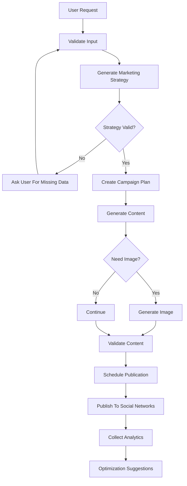
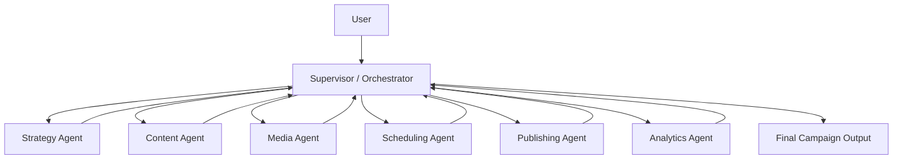
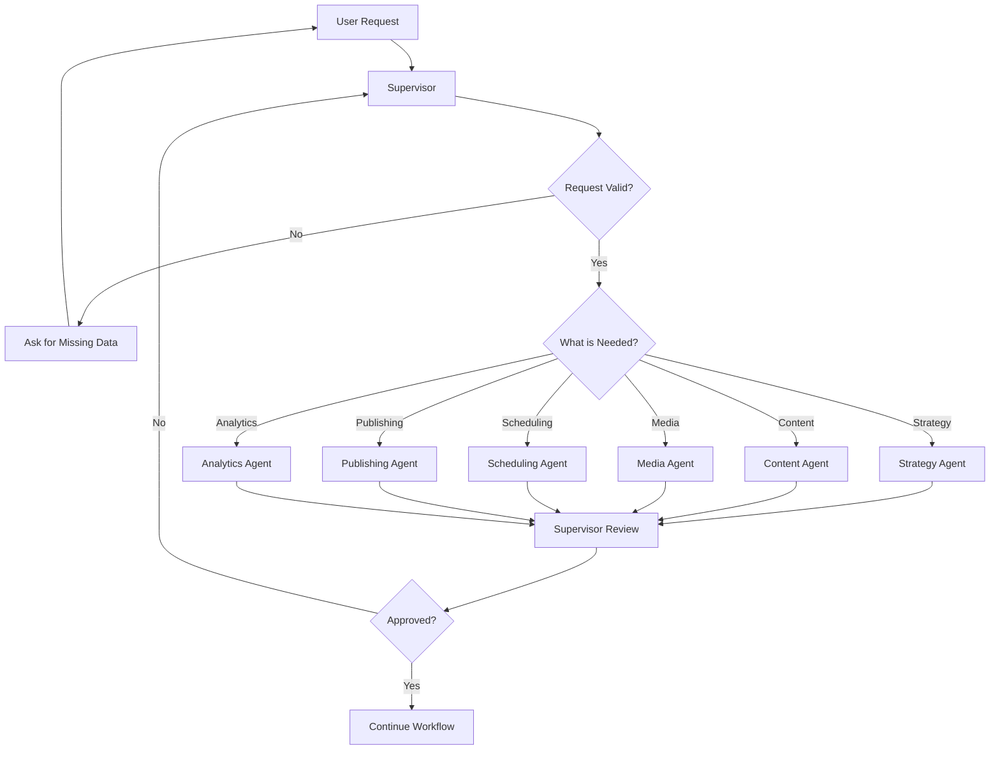
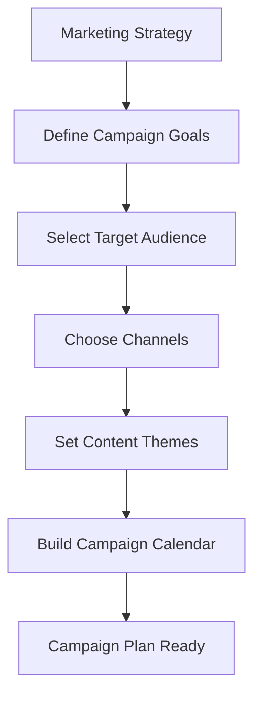

# nova-ai-marketing-agent
AI-powered marketing and social media automation agent for content generation, campaign planning, image creation, scheduling, and analytics.

## Workflow


1) Supervisor orchestration flow

2) Campaign planning flow

3) Content generation flow
```mermaid
flowchart TD
  A[Campaign Plan] --> B[Create Content Brief]
  B --> C[Generate Draft Content]
  C --> D[Check Tone and Brand Voice]
  D --> E{Valid?}

  E -->|No| F[Revise Draft]
  F --> C

  E -->|Yes| G[Adapt for Platform]
  G --> H[Final Content Output]
  ``` 
