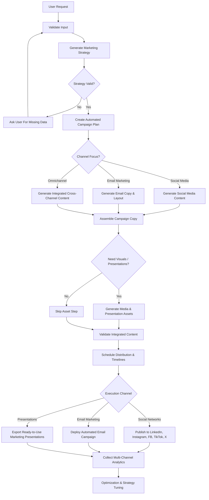
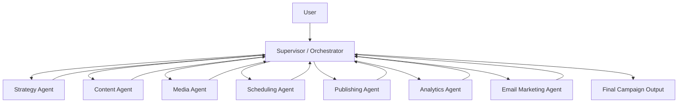
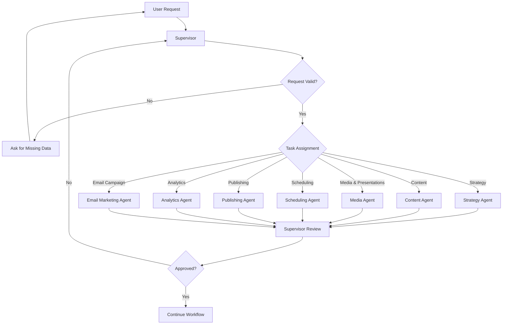
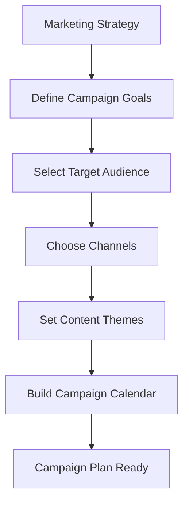

# nova-ai-marketing-agent
AI-powered marketing and social media automation agent for content generation, campaign planning, image creation, scheduling, and analytics.

## Workflow


1) Supervisor orchestration flow

2) Campaign planning flow

3) Content generation flow
```mermaid
flowchart TD
  A[Campaign Plan] --> B[Create Content Brief]
  B --> C[Generate Draft Content]
  C --> D[Check Tone and Brand Voice]
  D --> E{Valid?}

  E -->|No| F[Revise Draft]
  F --> C

  E -->|Yes| G{Content Format?}
  
  G -->|Social Post| H[Adapt for LinkedIn, Instagram, FB, TikTok, X]
  G -->|Email Copy| I[Structure Email Text & Subject Line]
  G -->|Presentation| J[Draft Marketing Presentation Outline]

  H --> K[Final Content Output]
  I --> K
  J --> K
  ``` 
4) Media Generation diagram
```mermaid
flowchart TD
  A[Need Media or Presentation Assets?] --> B{Asset Required?}

  B -->|No| C[Skip Asset Generation]
  B -->|Yes| D{Asset Type?}

  D -->|Single Image| E[Create Image Prompt]
  D -->|Carousel| F[Define Carousel Goal]
  D -->|Presentation PDF| G[Select Presentation Template]
  D -->|Other Media| I[Generate Alternative Media]

  E --> J[Generate Image]
  F --> K[Create Slide Outline]
  G --> L[Prepare Presentation Content]
  I --> N[Prepare Media Asset]

  J --> O[Check Image Quality]
  K --> P[Generate Slides]
  L --> Q[Render Layout]
  N --> S[Validate Alternative Media]

  O --> T{Approved?}
  P --> U[Check Visual Consistency]
  Q --> V[Validate Formatting]
  S --> X{Valid?}

  T -->|No| E
  T -->|Yes| Y[Save Image]

  U --> Z{Approved?}
  V --> AA{Approved?}
  X -->|No| I
  X -->|Yes| AC[Save Asset]

  Z -->|No| F
  Z -->|Yes| AD[Export Carousel Package]

  AA -->|No| G
  AA -->|Yes| AE[Export Presentation PDF]

  Y --> AF[Attach to Campaign]
  AD --> AF
  AE --> AF
  AC --> AF
  ```

5) Publishing flow
```mermaid
flowchart TD
  A[Final Content + Media Assets] --> B[Validate Channel Formats]
  B --> C[Select Deployment Schedule]
  C --> D{Distribution Channel?}
  
  D -->|Social Networks| E[Format for LinkedIn, Instagram, FB, TikTok, X]
  D -->|Email Marketing| F[Queue in Email Automation System]
  
  E --> G[Automated Social Publication]
  F --> H[Trigger Email Campaign Dispatch]
  
  G --> I[Confirm Live Status]
  H --> I
  ```
6) Analytics and optimization loop
```mermaid
flowchart TD
  A[Published Campaign / Dispatched Emails] --> B[Collect Multi-Channel Analytics]
  B --> C[Measure Performance Metrics]
  C --> D[Generate AI Insights]
  D --> E[Formulate Optimization Suggestions]
  E --> F[Update Central Strategy]
  F --> G[Initiate Next Campaign Cycle]
  ```
