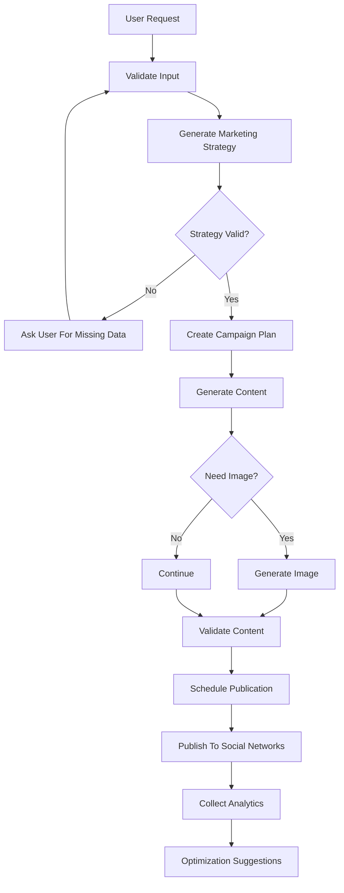

# nova-ai-marketing-agent
AI-powered marketing and social media automation agent for content generation, campaign planning, image creation, scheduling, and analytics.

## Workflow

```mermaid
flowchart TD

A[User Request] --> B[Validate Input]

B --> C[Generate Marketing Strategy]

C --> D{Strategy Valid?}

D -->|No| E[Ask User For Missing Data]
E --> B

D -->|Yes| F[Create Campaign Plan]

F --> G[Generate Content]

G --> H{Need Image?}

H -->|Yes| I[Generate Image]

H -->|No| J[Continue]

I --> K[Validate Content]
J --> K

K --> L[Schedule Publication]

L --> M[Publish To Social Networks]

M --> N[Collect Analytics]

N --> O[Optimization Suggestions]
```
