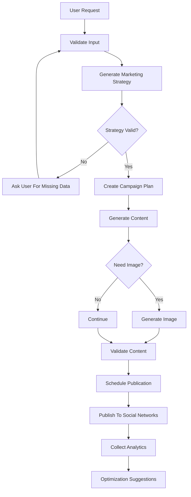

# nova-ai-marketing-agent
AI-powered marketing and social media automation agent for content generation, campaign planning, image creation, scheduling, and analytics.

## Workflow

1) Supervisor orchestration flow
```mermaid
flowchart TD
  A[User Request] --> B[Supervisor]
  B --> C{Request Valid?}

  C -->|No| D[Ask for Missing Data]
  D --> A

  C -->|Yes| E{What is Needed?}

  E -->|Strategy| F[Strategy Agent]
  E -->|Content| G[Content Agent]
  E -->|Media| H[Media Agent]
  E -->|Scheduling| I[Scheduling Agent]
  E -->|Publishing| J[Publishing Agent]
  E -->|Analytics| K[Analytics Agent]

  F --> L[Supervisor Review]
  G --> L
  H --> L
  I --> L
  J --> L
  K --> L

  L --> M{Approved?}
  M -->|No| B
  M -->|Yes| N[Continue Workflow]
